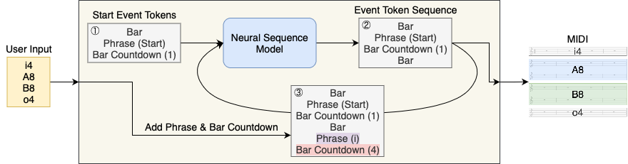

<link href="style.css" rel="stylesheet">

# Paper
Daiki Naruse, Tomoyuki Takahata, Yusuke Mukuta, Tatsuya Harada  
**Pop Music Generation with Controllable Phrase Lengths** (P1-14)   
The 23rd International Society for Music Information Retrieval Conference (ISMIR), 2022

[Project Page in ISMIR 2022](https://ismir2022program.ismir.net/poster_322.html)

<!-- | [ Paper](https://ismir2022program.ismir.net/poster_322.html) | [ Poster](https://ismir2022program.ismir.net/poster_322.html) | [ Video](https://drive.google.com/file/d/1Vzij-z2_GQnhf2pjWhJFr8Abf8Zyel5o/view) | -->

# Overview
We enabled phrase lengths control with a sequential generation policy by
- Adding Phrase and Bar Countdown events to the existing event-based music representations (REMI[^REMI] and CP[^CP])
	- Phrase: Which phrase a bar belongs to
	- Bar Countdown: The number of bars remaining in a phrase
- Extending autoregressive generation to reflect user input

<!-- We proposed a method to control phrase lengths with a sequential generation policy. -->

In this task, the input is the phrase configuration (the label and length of each phrase). The target output is a piece with designated phrase lengths. The phrase switching at the designated position and the natural closure at the end of the outro phrase are required.

<!-- 
- Input: Phrase configuration
	- Label and length of each phrase
- Output: A piece with designated phrase lengths
	- Phrase switching at designated position
	- Natural closure at the end of outro 
-->

&#9312; Start event tokens are input to the model to start generation  
&#9313; Next event tokens are predicted by the model  
&#9314; Phrase and Bar Countdown are added based on user input  

<!-- 
1. Start event tokens are input to the model to start generation
1. Next event tokens are predicted by the model
1. Phrase and Bar Countdown are added based on user input 
-->

# Demo
Some samples of the generated pieces are presented below.
We show [success samples](#success-samples), [samples by phrase configurations with repetitions](#samples-by-phrase-configurations-with-repetitions), and [failure samples](#failure-samples).

<!-- We show [success samples](#success-samples), [samples by phrase configurations with repetitions](#samples-by-phrase-configurations-with-repetitions), [failure samples](#failure-samples), and [pieces used for evaluation](evaluated-pieces). -->

## Success Samples
Here are some of our favorite pieces generated by each of our methods (REMI + Ph&BC and CP + Ph&BC).

<!-- Here are the best pieces of each of our methods (REMI + Ph&BC and CP + Ph&BC). -->
<!-- - [REMI + Ph&BC (ours)](#remi--phbc-ours) -->
<!-- - [CP + Ph&BC (ours)](#cp--phbc-ours) -->
<!-- ### REMI + Ph&BC (ours) -->
<!-- ### CP + Ph&BC (ours) -->

### REMI + Ph&BC

|Phrase configuration|Generated piece|
|:-:|:-:|
|i4 A8 B8 o4|<video controls><source src="videos/REMIPhBC_Success_i4A8B8o4.mp4">Your browser does not support the video tag.</video>|
|i8 A8 o8|<video controls><source src="videos/REMIPhBC_Success_i8A8o8.mp4">Your browser does not support the video tag.</video>|
|i4 A8 B8 C8 o4|<video controls><source src="videos/REMIPhBC_Success_i4A8B8C8o4.mp4">Your browser does not support the video tag.</video>|

### CP + Ph&BC

|Phrase configuration|Generated piece|
|:-:|:-:|
|i4 A8 B8 o8|<video controls><source src="videos/CPPhBC_Success_i4A8B8o4.mp4">Your browser does not support the video tag.</video>|
|i8 A8 o8|<video controls><source src="videos/CPPhBC_Success_i8A8o8.mp4">Your browser does not support the video tag.</video>|
|i4 A8 B8 C8 o4|<video controls><source src="videos/CPPhBC_Success_i4A8B8C8o4.mp4">Your browser does not support the video tag.</video>|

## Samples by Phrase Configurations with Repetitions
Even if a phrase configuration with repetitions is used as input, it is not possible to create repetitions.
If the input is "A8 B8 A8," the first A and the second A would be different.

### REMI + Ph&BC

|Phrase configuration|Generated piece|
|:-:|:-:|
|i4 A8 B8 A8 B8 o4|<video controls><source src="videos/REMIPhBC_Repetition_i4A8B8A8B8o4.mp4">Your browser does not support the video tag.</video>|
|i4 A8 B8 x4 A8 B8 o4|<video controls><source src="videos/REMIPhBC_Repetition_i4A8B8x4A8B8o4.mp4">Your browser does not support the video tag.</video>|

### CP + Ph&BC

|Phrase configuration|Generated piece|
|:-:|:-:|
|i4 A8 B8 A8 B8 o4|<video controls><source src="videos/CPPhBC_Repetition_i4A8B8A8B8o4.mp4">Your browser does not support the video tag.</video>|
|i4 A8 B8 x4 A8 B8 o4|<video controls><source src="videos/CPPhBC_Repetition_i4A8B8x4A8B8o4.mp4">Your browser does not support the video tag.</video>|

## Failure Samples
These are examples of failures, which don't have the phrase switching at the designated position and the natural closure at the end of the outro phrase.   

### REMI + Ph&BC

|Phrase configuration|Generated piece|
|:-:|:-:|
|i4 A8 B8 o4|<video controls><source src="videos/REMIPhBC_Failure_i4A8B8o4.mp4">Your browser does not support the video tag.</video>|
|i4 A8 B8 o4|<video controls><source src="videos/REMIPhBC_Failure_i4A8B8C8o4.mp4">Your browser does not support the video tag.</video>|

### CP + Ph&BC

|Phrase configuration|Generated piece|
|:-:|:-:|
|i4 A8 B8 o4|<video controls><source src="videos/CPPhBC_Failure_i4A8B8o4.mp4">Your browser does not support the video tag.</video>|
|i4 A8 B8 o4|<video controls><source src="videos/CPPhBC_Failure_i4A8B8C8o4.mp4">Your browser does not support the video tag.</video>|

 

---

### Acknowledgement
This work was partially supported by JST AIP Acceleration Research JPMJCR20U3, Moonshot R&D Grant Number JPMJPS2011, CREST Grant Number JPMJCR2015, JSPS KAKENHI Grant Number JP19H01115, and Basic Research Grant (Super AI) of Institute for AI and Beyond of the University of Tokyo.

---

[^REMI]: Y.-S. Huang and Y.-H. Yang, “Pop Music Transformer: Beat-based Modeling and Generation of Expressive Pop Piano Compositions,” in ACM Multimedia, 2020. [Paper](https://arxiv.org/abs/2002.00212)
[^CP]: W.-Y. Hsiao, J.-Y. Liu, Y.-C. Yeh, and Y.-H. Yang, “Compound Word Transformer: Learning to Compose Full-Song Music over Dynamic Directed Hypergraphs,” in AAAI, 2021. [Paper](https://arxiv.org/abs/2101.02402)

